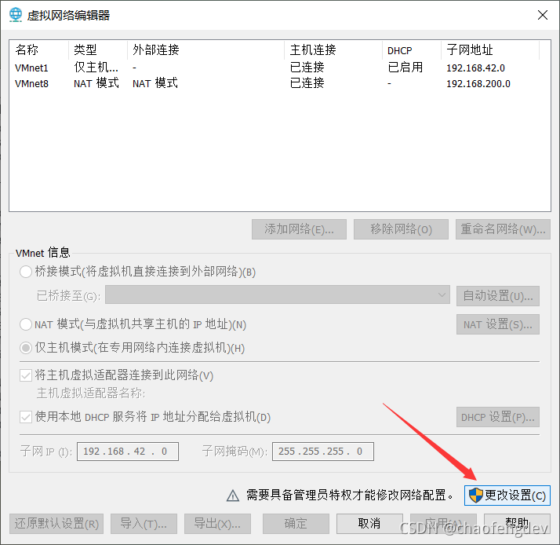
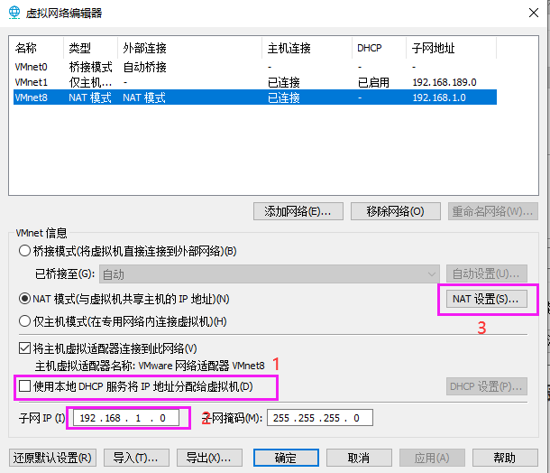
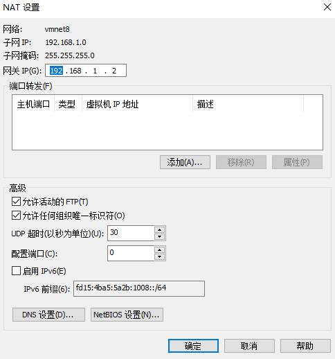
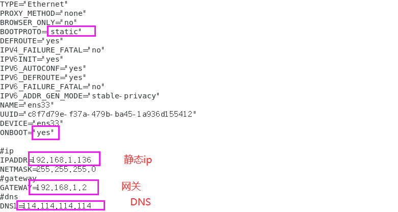

## 1、设置虚拟网关

#### 点击导航栏上面的【编辑】-->【虚拟网络编辑器】，并以【管理员】的身份打开虚拟机。



####  点击【VMnet8 NAT模式】，取消使用本地使用本地[dhcp](https://so.csdn.net/so/search?q=dhcp&spm=1001.2101.3001.7020)服务，配置网络段（子网ip段）为192.168.1.0，点击NAT设置。



####  配置【网关ip】，注意【网关ip】需要在【子网ip】段下，这里设置为192.168.1.2




------


## 2、配置虚拟机静态ip

####  打开命令行，输入

```shell
vim /etc/sysconfig/network-scripts/ifcfg-ens33
```

#### 并修改配置文件内容。




```shell
#ip
IPADDR=192.168.1.136
NETMASK=255.255.255.0
#gateway
GATEWAY=192.168.1.2
#DNS
DNS1=114.114.114
```

==注：DNS1是dns服务器，一般设置为114.114.114.114、114.114.115.115和8.8.8.8等（其他的也可以，只不过这几个用的人比较多而已）==


------


## 3、检测配置是否成功

- #### 重启网络服务

```shell
service network restart
```

- #### ping一下百度

```shell
ping www.baidu.com
```


